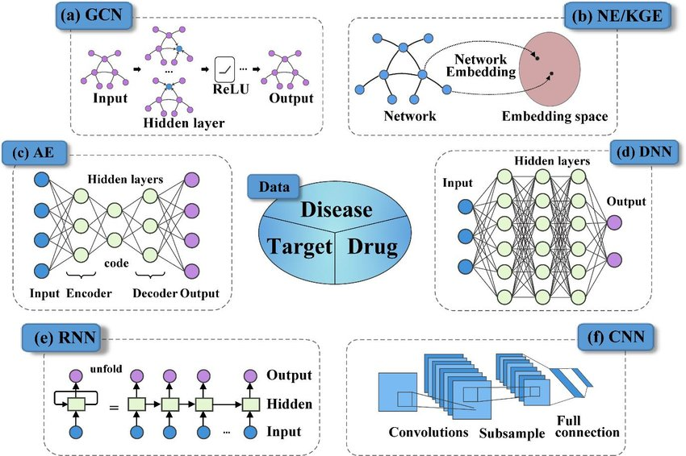

# Molecular Drug Discovery Using Graph Neural Networks

## Project Overview
This project aims to leverage Graph Neural Networks (GNNs) for drug discovery, focusing on molecular analysis to identify potential drug candidates efficiently and accurately. By representing molecular structures as graphs, GNNs can capture complex relationships within chemical compounds, leading to data-driven predictions of properties and interactions crucial in drug development.

As a mentee, you’ll learn the fundamentals of Graph Neural Networks, their application in computational drug discovery, and the process of training these models to make predictions based on molecular data.

## Learning Resources
Before diving into the implementation, here’s a list of essential resources to help you build a strong foundation:

### Week 1: Get Familiar with Python Libraries
- **Libraries**: Numpy, Matplotlib, PyTorch

#### References for Python
- [GeeksforGeeks: Python Programming Language Tutorial](https://www.geeksforgeeks.org/python-programming-language-tutorial/)
- [Python Documentation](https://docs.python.org/3.13/)

  Get Familier with basic python syntax, datatypes, functions and basics of object oriented programming

#### References for Pandas and Matplotlib
- [YouTube: Pandas and Matplotlib Tutorial](https://youtu.be/QUT1VHiLmmI?si=JS20LFX4ul24vlRJ)
- [GeeksforGeeks: Matplotlib Tutorial](https://www.geeksforgeeks.org/matplotlib-tutorial/)
- [Numpy Documentation](https://numpy.org/doc/2.1/user/basics.html)
  - Just get to know about the working of numpy arrays, dimensions, axes, matrix operations, broadcasting and try to go over more examples from internet for practice
  - Just get to know the basic graphs plottings which will be used heavily when training any ML model to analyse the training process and sometimes potentially for debugging

#### Understanding the Basics of Neural Networks
- **Tutorials**:
  - [Medium: Introduction to Neural Networks](https://medium.com/deep-learning-demystified/introduction-to-neural-networks-part-1-e13f132c6d7e)
  - [YouTube: Neural Networks - Part 1](https://www.youtube.com/watch?v=BzcBsTou0C0)
  - [YouTube: Neural Networks - Part 2](https://www.youtube.com/watch?v=aircAruvnKk)
  - [YouTube: Neural Networks - Part 3](https://www.youtube.com/watch?v=c36lUUr864M)

- **Articles**:
  - [Medium: A Beginner Intro to Neural Networks](https://purnasaigudikandula.medium.com/a-beginner-intro-to-neural-networks-543267bda3c8)

- **Reading**: 
  - Read the introductory chapter from “Introduction to Machine Learning - Gurney et al.” and optionally the theory (highly recommended).
  - Complete the given tutorials. Leave the advanced neural networks part of it.

> **Note**: We know that the tutorials we provided mostly cover the implementation of neural networks; we just want you to play with it yourself and understand each part of the code. You can also refer to the book mentioned above for a better understanding of the theory.

### Assignments
- **Assignment 1**: Implement K-means clustering algorithm to get used to Numpy operations.
- **Assignment 2**: Implement Feed Forward Neural Network on cat and dog dataset from Kaggle and improve the model accuracy using various preprocessing techniques and hyperparameter fine-tuning.
- **Assignment 3 (Optional)**: Implement the Feed Forward Neural Network using Numpy and compare the results with the PyTorch implementation.

### Week 2: Understanding Advanced Neural Networks and Graph Neural Networks
- **Resources**: 
  - To get the intuition of ReLU activation, read this article: [Visualizing Piecewise Linear Neural Networks](https://blog.janestreet.com/visualizing-piecewise-linear-neural-networks/).
  - Go over this [Coursera course](https://www.coursera.org/learn/neural-networks-deep-learning) to learn more about neural networks.

#### For Graph Neural Networks
- **Articles for Basic Ideas**:
  - [Neptune.ai: Graph Neural Network and Some of GNN Applications](https://neptune.ai/blog/graph-neural-network-and-some-of-gnn-applications)
  - [Distill.pub: Understanding GNNs](https://distill.pub/2021/understanding-gnns/)
  - [Towards Data Science: Graph Convolutional Networks](https://towardsdatascience.com/graph-convolutional-networks-introduction-to-gnns-24b3f60d6c95)

- **Optional Readings**:
  - Read and understand the research paper: [Neural Message Passing for Quantum Chemistry](https://arxiv.org/pdf/1704.01212).
  - Read this article on how to use Graphical Neural Networks in drug discovery: [Drug Discovery and Graph Neural Networks](https://medium.com/@mulugetas/drug-discovery-and-graph-neural-networks-gnns-a-regression-example-fc738e0f11f3).

#### Tutorials and Videos
- [YouTube: Graph Neural Networks Introduction](https://www.youtube.com/watch?v=8owQBFAHw7E)
- [YouTube Playlist: Graph Neural Networks](https://youtube.com/playlist?list=PLoROMvodv4rPLKxIpqhjhPgdQy7imNkDn&si=GiLMZdfS5szrhH0z)
